# 🐧 Linux aula 01 pt-02

## Manipulação de arquivos e pastas


<hr>

### Diretórios
<br>
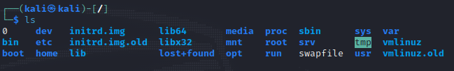

<hr>

<strong>/ </strong>  *É o diretório-raiz, onde tudo começa. Ele seria equivalente ao <strong>C:\ </strong> do Windows, mas diferente do sistema operacional de Redmond, um sistema <strong> &lowast;
nix </strong> tem sempre uma raiz única; o Windows cria uma raiz (ou diretório inicial) para cada volume, sempre identificando com uma letra **(D:\ , E:\ , A:\ e por ai vai)**. Outros volumes do Linux são "pendurados" nesta raiz única iniciada em **"/"**, e isso traz uma série de vantagens. O termo exato, na verdade, é que os "volumes são montados".*
<hr>

**/bin** *É o diretório dos binários no Linux. Os comandos que podem ser executados de alguma forma por quelquer usuário ficam por aqui.*
<hr>

**/boot**  *Armazena os arquivos necessários para realizar o boot do sistema Linux.*
<hr>

**/dev** *"dev" é uma apreviação da palavra inglesa devices, ou dispositivos; diferentes do Windows que possuímos uma lista de dispositivos como esta: em sistemas <strong> &lowast;
nix </strong>,* 
*os dispositivos viram arquivos fazendo parte do sistema de arquivos. Sendo assim, periféricos, como mouses, impressoras, webcams, e dispositivos embarcados, como HDs e suas partições, tudo vira um arquivo em **/dev***
<hr>

**/etc** *Os arquivos de configuração ficam aqui, especialmente os de serviços da màquina; quando a configuração é especificada para um determinado usuário, geralmente ficam em pastas ocultas (iniciadas com **"."**, ponto) no diretório do usuário.*
<hr>

**/home** *Armazena os diretórios de usuários, sendo equivalente ao **C:\Usuários** ou **C:\Users**. Cada usuário possui seu próprio deretório (Por exemplo, meu usuário **"bilbo"** possui o **/home/bilbo**).*
<hr>

**lib** *e* **lib64** *Equivalente ao **C:\Windows\System** e **C:\Windows\System32**, são os diretórios onde ficam as bibliotecas de sistema; as bibliotecas em 64bits ficam em **/lib64**, enquanto as 32bits ficam em **/lib**.*
<hr>

**/lost+found** *Diretório de **"achados e perdidos"** do sistema. Em uma eventual falha no sistema de arquivos, o comando **fsck** deve ser utilizado e, caso ache arquivos ou fragmentos dele que não sabe onde guardar, eles ficam armazenados por aqui.*
<hr>

**/media** *e* **/mnt** *Diretórios de **"montagem"** de volumes, como pendrives CD-ROMs e DVD-ROMs.*
<hr>

**/opt** *Diretório opcional, pode se utilizado como diretório alternativo de instalação de programas.*
<hr>

**/proc** *Diretório virtual de informações do sistema; através de seus pseudo arquivos, podemos obter informações sobre o processador, uso de memória, entre outros.*
<hr>

**/root** *Diretório pessoal do **super usuário** ou **root**.*
<hr>

**/run** *Os processos em andamento (rodando ou run) geram arquivos **.pid** que ficam armazenados por aqui.*
<hr>

**/sbin** *Os binários (comandos) específicos para uso do **super usuário (root)** ficam armazenados aqui.*
<hr>

**/srv** *Dados de serviços em execução ficam armazenados neste diretório.*
<hr>

**/sys** *(apenas para kernels 2.6.x ou superiores) armazena os módulos para equipamentos USB.*
<hr>

**/tmp** *Diretórios de arquivos temporários, que podem ser gerados por serviços ativos; é equivalente ao **C:\Windows\Temp**.*
<hr>

**/usr** *É aqui que os programas são instalados, assim sendo, seria equivalente ao **C:/Arquivos** de programas our **C:\Program Files**.*
<hr>

**/var** *O diretório **var** armazena informações de tamanhos variados; é nele, por exemplo, que os arquivos que armazenam dados em um banco de dados ficam.*
<hr>

**/var/log** *Como também é uma informação do tamanho variado, os logs sistema ficam neste subdiretório.*
<hr>

## Avançando


<hr>

### Listar arquivos e diretórios

**ls** *O comando permite exibir informações dos arquivos e subdiretórios de um determinado diretório.*
```sh
 ls
```
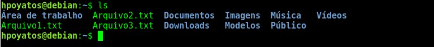

*Em sua execução simples, exibira apenas o nome dos arquivos e diretórios. Graças ao padrão de cores, podemos diferenciar o que é arquivo (em verde) do que é diretório (em azul). Não se baseie, no entanto, em extensões de arquivos: diferentes do Windows, elas são completamente dispensáveis. A extensão "txt" nos três arquivos do exemplo é apenas para fácil indentificação e para seu maior conforto.*

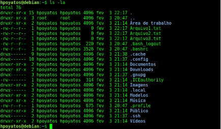

*O comando **ls** é geralmente executado com dois parâmetros muitos úteis: **"-l"**, que exibe uma lista longa ou detalhada de informações, e o **"-a"**, que vem de **all**, ou seja, traga **todos** os arquivos e diretórios, mesmo aqueles que são ocultos.*

*Repare que vários outros arquivos e diretórios fizeram parte da listagem agora; seguindo o padrão do Unix, arquivos e diretórios ocultos são precedidos por **" . " (ponto)**. Uma grande variedade de informaçôes é trazida nesta lista, sendo:*

* **Primeira coluna - Tipo de arquivo e permissionamento:** *Contendo sempre 10 caracteres, os primeiros deles se referem ao tipo de arquivo: um arquivo comum é representado por um traço **" - "**, e um diretório pela letra **" d "**. Você verá ainda as letras **" l "**(aquivo de link), **" b "** e **" c "**(para dispositivos, que transmitem por bloco ou **" b "** e caracter **" c "**). Os nove caracteres restantes devem ser lidos em conjuntos de três em três: os três primeiros são as permissôes do dono do arquivo; os três do meio permissões do grupo dono do arquivo; e os três finais, dos demais. As letras **" rwx "** simbolizam leitura (**r** de **read**), (**w** e **escrita**) e (**x** de **execuçaõ**).*

* **Segunda coluna - Quantidade de arquivos:** *Indica a quantidade de arquivos ou diretórios aquele elemento possui. Repare que arquivos possuem sempre o número **1**, enquanto diretórios, geralmente, têm valores maiores. Na imagem de exemplo, **" .config "** possui 10 arquivos ou subdiretórios dentro dele.*

* **Terceira coluna:** *Exibe o nome do dono do arquivo. Quando o nome não estiver disponível, exibe o número indentificador do usuário **(uid)**.*

* **Quarta coluna:** *Mostra o nome do grupo dono doarquivo; quando o nome não estiver disponível, exibe o número indentificador do grupo **(gid)**.*

* **Quinta coluna:** *Exibe o tamanho de **bytes** do aquivo. Ao acrescentar o parâmetro **" h " (ls -lh)**, o tamanho fica mais legível para humanos, sendo apresentado em **megabytes, gigabytes** ou a unidade de medida mais próxima.*

* **Sexta coluna:** *Mostra a data da última modificação no arquivo ou diretório.*

* **Sétima coluna:** *O nome do arquivo ou diretório propriamente dito.*

<br>

*Qunado o diretório do qual queremos lista não é mencionado, o comando automaticamente exibe o conteúdo do diretório atual ( em meu caso, diretório de  meu usuário, **/home/bilbo** ). O diretório desejado pode ser indicado logo depois dos parâmetros (au ates, por que não ? ):*

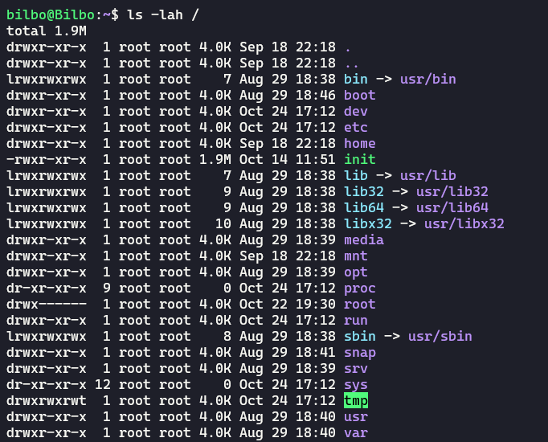
<br>
<hr>

### Mostrar diretório ou pasta atual

**pwd - ( print work directory ):** 
```sh
 pwd
```
*É um comando pertinente especialmente em situações em que o prompt de comandos não exibe o diretório atual.*

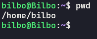

*No exemplo em questão, possui um prompt que mostra o diretório, as de maneira resumida: **" ~ "** será sempre o diretório-padrão ou home do usuário que está sendo utilizado.*

<hr>

### Mudar de diretório ou pasta

**cd** *O comando é um acrónimo de **change directory** e permite mudar o diretório atual. O diretório pode ser mencionado tanto com seu caminho completo ou absoluto **( /home/bilbo )** quanto o caminho relativo, que recebe este nome porque é relativo ao diretório que estamos naquele momento. Ou seja **cd bilbo** ( sem a barra antes do bilbo), estando no diretório **/home**, possibilitará acessar o subdiretório bilbo, **/home/bilbo**.*

```sh
 cd /directory/directory or cd ..
```

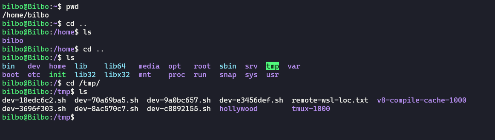

*O comando **cd..** indica o acesso ao diretório superior ou pai (simbolizado pelo ponto-ponto). A chamada do comando **cd** sem nenhuma informação adicional resulta na troca para o diretório-padrão do usuário, ou seja, equivale ao comando **cd~** ou, no meu caso, **cd /home/bilbo**.*
<hr>

### Criar um diretório

**mkdir** *O comando mkdir é uma abreviação da frase inglesa " make a directory ", que significa literalmente " criar um diretório " .*
```sh
 mkdir Nova\ Pasta

 mkdir Nova_Pasta

 mkdir "Nova pasta"
```
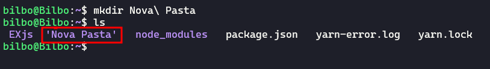

*Repare que caracteres especiais ( como esoaços " " ou a própria barra invertida ) são permitidos, desde que sejam percebidos por uma barra invertida. **Atenção** o Linux é [case-sensitive](https://profound-information.com/why-is-linux-terminal-case-sensitive/), sendo, assim a pasta criada no exemplo foi " Nova Pasta " e não " nova pasta " ( e muito menos NoVa PaStA ).*

*Outra consideração é o fato de que o comando não me congratulou por ter escrito o comando corretamente; não acontece uma mensagem "Diretório criado com sucesso". O sistema operacional só apresenta uma mensagem em aso de fracaso, ou seja, não espere um "parabéns" por ter acertado o comando ( o Linux provavelmente acredita que " não fiz mais do que minha obrigação " ).*

*Um parâmetro muito útil para acompanhar o **mkdir** é o **" -p "**, especialmente em situações que eu esteja criando subdiretórios.*

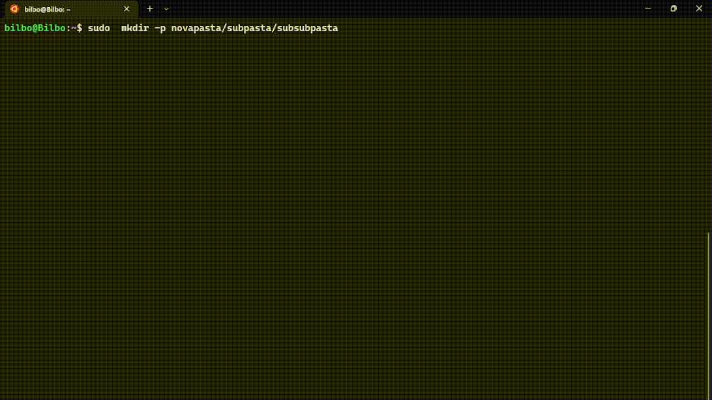

*Presumindo que eu esteja em meu diretório de usuário (/home/bilbo), o comando em questão criou uma pasta "Nova Pasta2", um "subdiretório" dentro desta e um subdiretório "subsubpasta" dentro de "subpasta". Sem parâmetro **" -p "**, o comando apresentario um erro, pois ele tentaria localizar a "Nova Pasta2" e não encontraria, ou seja, mkdir Nova\ Paasta2/subpasta/subsubpasta(sem o **" -p "** ) só criaria o diretório "subsubpasta", tendo como condição **/home/bilbo/Nova Pasta2/subpasta como um caminho existente e válido**.*
<hr>

### Apagando um arquivo ou diretório

**rm** *O comando rm é uma abreviação para o verbo inglês **to remove** e permitirá que apaguemos um arquivo ou um direrório. Embora exista o comando **rmdir**, restrito apenas para remoção de diretórios, vamos nos ater ao comando que apaga qualquer um dos dois*
```sh
 rm /home/bilbo/package.json
```
*O comando apresentado remove o arquivo de texto " package.json " do diretório de usuário /home/bilbo. Repare que utilizei o caminho absoluto que, embora seja mais longo, possui menos risco de fazer algo errado. Posso rodar o comando **rm package.json** também, desde que eu tenha como diretório atual **/home/bilbo**; no entanto, se eu estiver em outro diretório que também possui um package.json, a confusão está criada.*

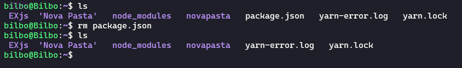

*Posso apagar diretórios, desde que o diretório em questão esteja completamente vazio (a regra vale para **rmdir** ). Ou seja:*
```sh
 rmdir /home/bilbo/novapasta/subpasta/subsubpasta 
```
*Na Linha de comandos **rmdir /home/bilbo/novapasta/subpasta/subsubpasta**, apenas o diretório "subsubpasta" seria apagado da existência, mantendo "novapasta" e "nuvapasta/subpasta" intactos. Apagar "novapasta" com o comando **rmdir ~ novapasta**(o " ~ " til abrevia /home/bilbo !) não daria certo, pois o diretório não está vazio neste momento, ele tem "subpasta" dentro dele.*


*Para facilitar onformo que o comando **rm** possui dois parâmetros usados: **" -r "** significa "recursivo", ou seja, se ao apagar "novapasta" ele tiver resistência, ele entra aos subdiretórios e os apaga primeiro, e seus subsubdiretórios caso existam, em um verdadeiro efeito cascata. Como se trata de um comando perigoso, o Linux fará uma pergunta para configurar cada diretório que eu tentar apagar, esperando um "y" indicando "yes" ou "n" indicando "not" o caso pode ser difente também ele pode pedir a senha de usuário **root**.*

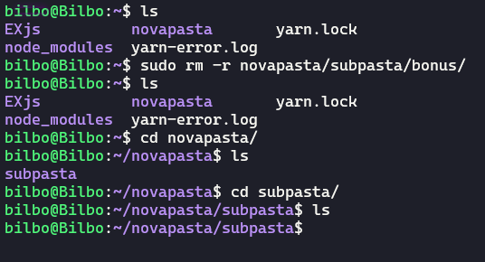
<br>

```sh
 rm -rf /home/bilbo/novapasta
```
*A  linha de comando **rm -rf /home/bilbo/novapasta** apaga o diretório "novapasta" e absolutamente tudo que estiver dentro dele, sem dó nem piedade; havia apenas um subdiretório "subpasta" vazio dentro dele, mas poderiam ter outros 5 milhões de arquivos que não faria a menor diferença (na verdade, faria, mas o comando demoraria um pouquinho) .*

***"Se eu me arrepender, eu restauro da Lixeira", não, não restaura! Lixeira é para usuários de interface gráfica que não sabem o que estão fazendo.***

*O comando só permite que eu apague arquivos e diretórios dos quais eu tenha permissão de fazê-lo, ou seja, o dano pode ser contido, a não ser que você seja o superusuário **root**.*
<hr>

### Copiando arquivos e diretórios 

**cp** *O comando é uma abreviatura do verbo inglês **to copy** e permite copiar arquivos e diretórios, solicitando sempre qual o arquivo copiado e, logo depois, para onde ele será copiado:*
```sh
 cp /home/bilbo/arquivo01.txt  /tmp
```
*No exemplo em linha de comando **cp /home/bilbo/arquivo01.txt /tmp**, o arquivo "arquivo01.txt" foi copiado para outro diretório, o diretório de arquivos temporários **/tmp**. É importante que você tenha permissão de escrita no diretório destino e, neste caso, **/tmp** permite a qualquer usuário de sistema escrever arquivos.*

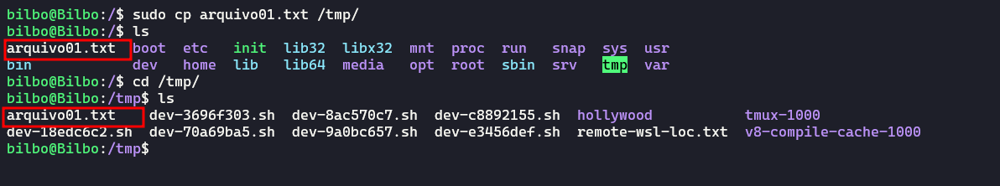
<br>

```sh
 cp /home/bilbo/arquivo01.txt /tmp/novoNome.txt
```
*O segundo exemplo em linha de comando **cp /home/bilbo/arquivo01.txt /tmp/novoNome.txt** faz a mesma operação, mas ao copiar renomeia o novo arquivo para "novoNome.txt". A primeira execução preservou o nome original, ou seja, **/tmp/arquivo01.txt** existe.*

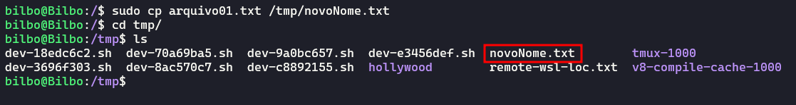

**Copiar diretórios inteiros** *é perfeitamente possível, mas precisamos de ajuda de três parâmetros: **" -R "** recursividade, ou seja, permite copiar o diretório e tudo contido dentro dele; o parâmetro **" -v "** vem da palavra em inglês **verbose** e é muito comum em comando Linux, neste caso, mostrará quais arquivos dentro do diretório foram copiados; conheça também **" -p "**, que preserva as permissões originais do arquivo copiado:*
```sh
 cp -Rvp /home/bilbo/EXjs/  novapasta/
```
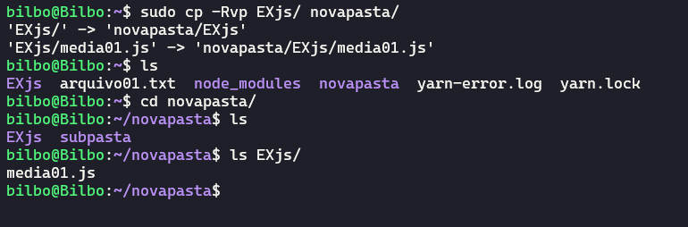

*O comando copiou o diretório EXjs com todo seu conteúdo (graças ao "-v", vemos que apenas um arquivo constava, "media01.js") para o diretório **/novapasta**.*
<hr>

### Movedo osu renomeando arquivos e diretórios

**mv** *O comando mv é uma abreviatura do verbo inglês **to move** e permite mover arquivos e diretórios e de um ponto a aoutro, solicitando sempre a origem e depois o destino:*
```sh
 mv EXjs/  novapasta/
```
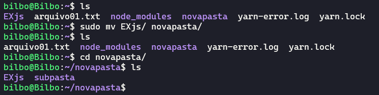

*No exemplo de comando **mv /tmp/Imagens /opt**, o diretório Imagens/ presente no diretório de arquivos temporários /tmp foi transferido para o diretório /opt; para dar certo, o usuário que realiza a operação precisa ter permissão de escrita no diretório destino. O processo para arquivos é indêntico.*

*Para renomear o arquivo, o procedimento é similar; basta informar o nome atual do arquivo e, na sequência, o novo nome (faça o mesmo para diretórios):*
```sh
 mv JS/arquivo01.txt  novapasta/arquivo02.txt
```
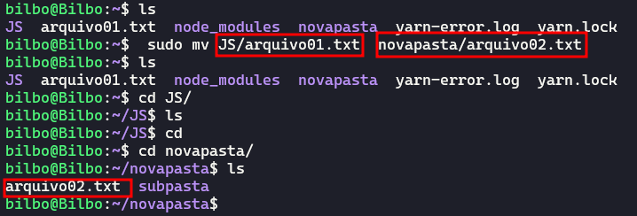
<hr>

### Exibindo o conteúdo de um arquivo

**cat** *O comando cat pode ser utilizado para exibir o conteúdo de um arquivo texto no terminal de comandos e deve ser acompanhado pelo caminho do arquivo.*
```sh
 cat 'nome do arquivo'
```

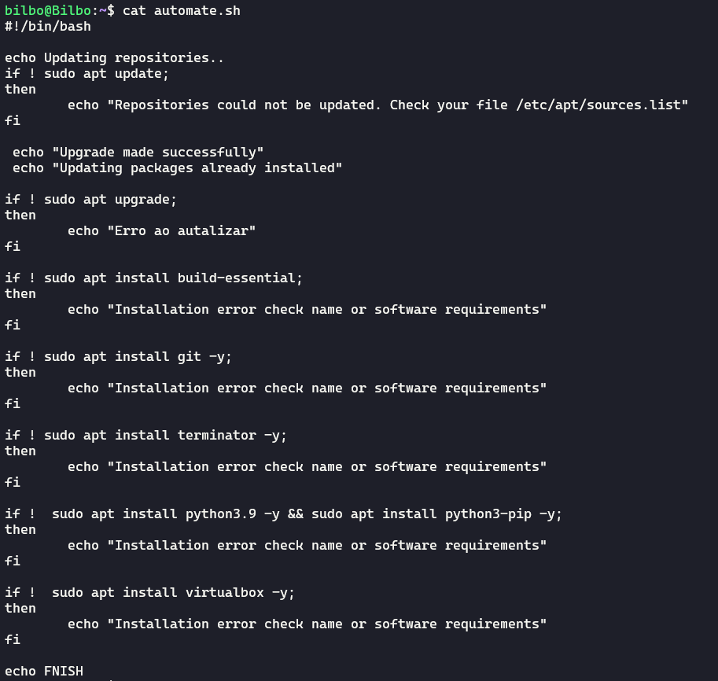
<hr>

### Exibir linhas iniciais de um arquivo

**head** *Como o nome indica, o comando **head** permite exibir o cabeçalho do arquivo, ou seja, é o comando **cat** que mostra apenas as linhas iniciais do arquivo; pode ser muito útil para arquivos muito grandes dos quais só precisa visualizar as primeiras linhas.*
```sh
 head 'nome do arquivo'
```
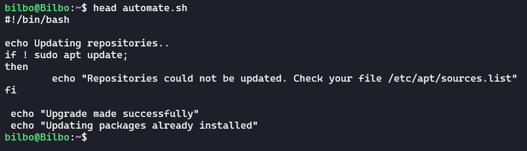
<br>

*Podemos também utilizar o parâmetro **" -n "**, que permite determinar o número de linhas iniciais que desejo ver do arquivo e está sendo usado para exibir as cinco primeiras linhas*
```sh
 head -n 'nome do arquivo'
```

<hr>

### Exibir linhas finais de um arquivo

**tail** *O comando tail faz o inverso do comando head, e a palavra em inglês significa: "cauda": exibe as últimas linhas do arquivo desejado. O parâmetro **" -n "** também pode ser usado aqui para definir o número de linhas finais que deseja exibir.*
```sh
 tail 'nome do arquivo'

 tail -n 7 'nome do arquivo'
```
*Muito utilizado para a leitura de arquivos de log, que geralmente são muito grandes e, em vários casos, desejamos apenas os últimos acontecimentos do sistema.*


*O comando está exibindo as três ultimas linhas do principal arquivo de log de sistema em, **/var/log/alternatives.log**.*
<hr>

### Exibe o conteúdo de um arquivo

**less** *O comando pode ser muito útil para visualizar aarquivos muito grandes, pois, com ele, podemos navegar no conteúdo do arquivo com as setas para cima e para baixo, pois a exibição com **cat** é de difícil navegação*


*Utilize as teclas para navegção as setas do teclado para cima e para baixo **[PAGE UP]** e **[PAGE DOWN]** e para sair use **" q "** de (quit) para sair do comando.*
<hr>

### Localizar Arquivos

*É difícil localizar um arquivo armazenado em um sistema de arquivos. Com o objetivo de facilitar esta tarefa, podemos usar o comando **locate**.*

*Primeiramente é preciso instalar o pacote do comando digitando o comando **sudo apt install locate**. Uma vez instalado, é necessário criar a base para buscas e, para tal, é necessário rodar o comando **sudo apt update** de tempos em tempos.*

*Para utilizar o comando, digite **locate** e o nome do arquivo que você deseja buscar:*

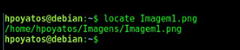
<hr>

### Localizar termos dentro de arquivos

**grep** *Trata-se de um excelente comando para realizar busca de palavras-chave dentro de arquivos; basta digitar a palavra-chave logo após o comando, seguido do local que deseja procurar.*

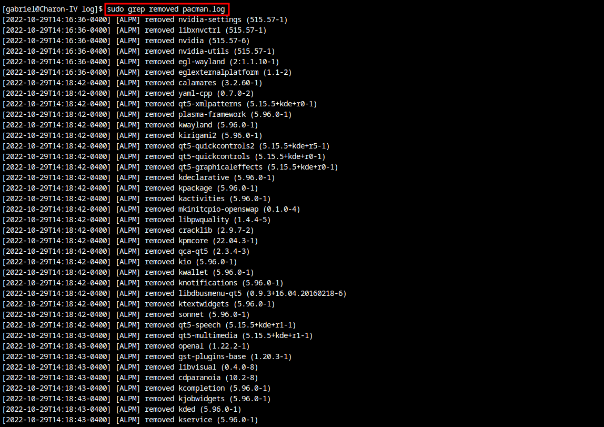

*No exemplo acima estamos buscando a palavra **removed** dentro de **/var/log/pacman.log**.*
<hr>

<br>

## [Linux Parte 03 (click me)](https://github.com/GabrielFerretto/programming_studies/blob/main/Linux-Fundamentos/mod/001-pt03.md "A parte 3 dos estudos ")

