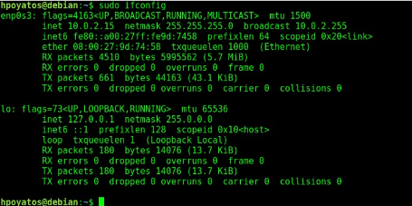
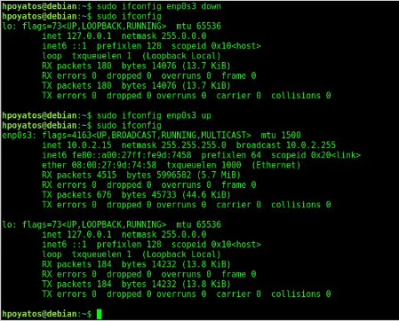
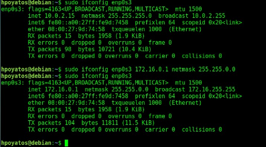
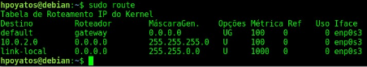
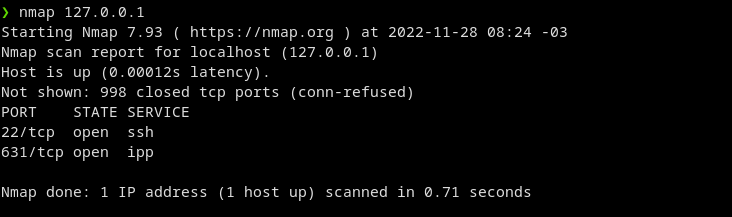

# 🐧 Linux aula 01 pt-03

# Configuração de Rede


<br>

Reconhecer como configurar as interfaces de rede em um sistema operacional Linux Possibilitará a comunicação desta máquina com outras em uma rede local ou na internet, logo, alguns comandos podem ser úteis, como veremos a seguir.

*Antes de começar, certifique-se que o pacote **net-tools** esteja instalado em seu Linux(Debian) , rodando a linha de comando:*
```sh
   sudo apt install net-tools
```
<hr>

### Configuração de redes

**ifconfig** *O comado ifconfig permite a configuração das informações mais básicas de uma interface de rede, como seu IP e a máscara de rede.*



*A execução de **sudo ifconfig** Fornece as informações sobre meu IPv4, máscara de rede e broadcast são apresentadas, assim como meu IPv6, e o endereço mac address, alémm de algumas estatísticas da interafce de rede (batizada aqui de enp0s3). Interfaces de rede outrora eram padronizadas como eth0, eth1, eth2 e assim por diante, mas a verdade é que seus nomes variam de acordo com o drive, seja placa de rede cabeada ou WI-FI.*

*A interface **lo** é o looback, sempre presente em qualquer sistema operacional. Seu ip padrão **127.0.0.1** indica como posso apontar para minha própria máquina, mesmo que a interface de rede real esteja inativa.*

<br>

```sh
  sudo ifconfig 'nome da rede' down

  sudo ifconfig 'nome da rede' up
```



*O comando **sudo ifconfig [nome da interface] down** permite desligar a interface. Já o comando **sudo ifconfig [nome da interface] up** permite ligar a interface.*

<br>

*Outra possibilidade trazida pelo comando ifconfig é alterar o ip e máscara de rede.*

*Repare, que o IP atual de minha maquina é **10.0.2.15** e a máscara, **251.251.251.0**; poderia trocar facilmente ambos para um ip interno de classe B.* <h2>⬇️</h2>



*Como podemos ver o exemplo acima, basta adcionar ao comando ifconfig e o nome da interface o IP desejado, a palavra **netmask** e a máscara de sub-rede, e a interface é facilmente configurada para o novo endereço.*

<hr>

### ROUTE - Estabelecendo Rotas de Rede

*O comando **route** serve para visualizar rotas existentes ou mesmo na criação de novas rotas; em um servidor com várias interfaces de redes ligadas a várias sub-redes diferentes, o estabelecimento destas rotas pode permitir melhorias estratégicas de infraestrutura importantes.*

```sh
   sudo route
```
*A execução e bem simples, o comando mostra as rotas já estabelecidas.*



*Para adcionar uma nova rota, basta usar o parâmetro **"add"** seguido do parâmetro **"net"**, para adcionar uma nova rede; o endereço da rede deve vir na sequência, seguido pela máscara de rede (opcional em algumas situações) e, após a palavras **"dev"**, a interface em questão:*

```sh
  sudo route add -net 192.36.73.0 netmask 251.251.251.0 dev enp0s3
```
*No exemplo na Linha de comando **sudo route add -net 192.36.73.0 netmask 251.251.251.0 dev enp0s3**, é adcionada uma rota para a rede 192.36.73.0, que dará saída pela interface **enp0s3**; a máscara, neste caso, seria opcional, pois o endereço de rede de classe **C** (que tem a máscara informada como padrão).*

*Para adcionar um **gateway-padrão**, a Linha de comando **sudo route add default gw 10.0.2.1** trazum exemplo:*

```sh
  sudo route add default gw 10.0.2.1
```
<hr>

### NMAP - Escaneamento de Portas

*Um dos grandes riscos para um computador conectado a uma rede são as portas de serviço que se encontram abertas, esperando para atender aos serviços de rede. Muitas destas portas são abertas por serviços que, por muitas vezes, não sabemo o porquê estão ativos e que portas abrem para tais. O comando **nmap** realiza um escaneamento de portas (o chamado Port Scan) na máquina-alvo, indicando quais portas estão abertas e como estão abertas.*

*Recomendo que você realize um escaneamento de portas apenas em máquinas das quais você conta, pois o ato é considerado um ataque de invasão preliminar. Antes de realizar o escaneamento, certifique-se que o **nmap** está instalado; caso não esteja, digite **sudo apt install nmap**. Para realizar a análise, dgite **nmap** e o **IP** da máquina em questão:*

```sh
  nmap 127.0.0.1
```


*Repare que decidi escanear meu próprio equipamento apontando para **loopback (127.0.0.1);** o escaneamento padrão dectectou apenas duas portas abertas uma delas é a **22**, geralmente destinada para o serviço de **ssh**.*