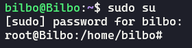
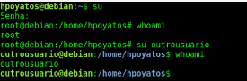
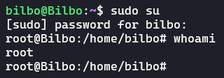
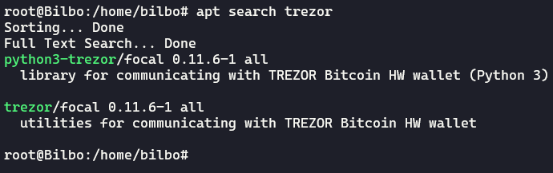
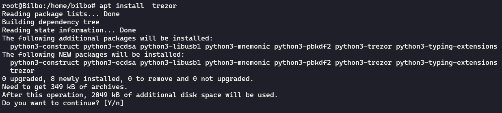

# Linux aula 01

+ Entendendo o terminal

**$**  *para usuário comum*

**#** *quando o usuário for root*



Em alguns casos termos de usar **sudo su**

## Comandos Essenciais

**man**  *para pedir ajuda, esse comando fornece o manual*
```sh
man ls
```
**--help** *esse comando é muito parecido com o **man** porem traz uma "ajuda" mais resumida*
```sh
ls --help
```
**su** *Por razões de segurança, é recomendável que o usuário sempre opere com seu próprio usuário, com permissões restritas. No entanto, em alguns momentos, é necessário torna-se outro usuário, costumeiramente, o superusuário root.*



<br>

Podemos usar também o comando **sudo su**



<hr>

# Atualizando os Pacotes do Sistema **.DEB**

**apt update** *O comando atualiza a referência dos repósitoriso, ou seja, ele baixa a lsita de pacotes disponíveis para download com suas versões. Com isso, o sisitema pode comparar as versões instaladas com as disponíveis, permintindo determinar quais pacotes poderiam ser atualizados.*
```sh
apt update
```


**apt upgrade** *O comando exibe a lista de pacotes que estão atualizados e confirma queremos realmente atualizá-los, Em caso positivo, apt baixa os pacotes e atualiza-os automaticamente.*
```sh
apt upgrade
```

**search** *O comando que permite buscar por pacotes antes de instalá-los.*
```sh
apt search pacote
```


<br>

**install** *Permite instalar pacotes disponíveis nos repositórios*
```sh
apt install trezor
```


*caso depois de instalado podemos remover o pacote usando **apt remove** *
```sh
apt remove pacote
```