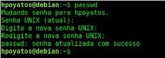
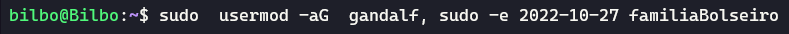

# 🐧 Linux aula 01

+ Entendendo o terminal
<br>

<div style="text-align:center">

</div>

**$**  *para usuário comum*

**#** *quando o usuário for root*


Em alguns casos termos de usar **sudo su**

## Comandos Essenciais

**man**  *para pedir ajuda, esse comando fornece o manual*
```sh
man ls
```
**--help** *esse comando é muito parecido com o **man** porem traz uma "ajuda" mais resumida*
```sh
ls --help
```
**su** *Por razões de segurança, é recomendável que o usuário sempre opere com seu próprio usuário, com permissões restritas. No entanto, em alguns momentos, é necessário torna-se outro usuário, costumeiramente, o superusuário root.*


<br>

Podemos usar também o comando **sudo su**


<hr>

# Atualizando os Pacotes do Sistema **.DEB**

**apt update** *O comando atualiza a referência dos repósitoriso, ou seja, ele baixa a lsita de pacotes disponíveis para download com suas versões. Com isso, o sisitema pode comparar as versões instaladas com as disponíveis, permintindo determinar quais pacotes poderiam ser atualizados.*
```sh
apt update
```


**apt upgrade** *O comando exibe a lista de pacotes que estão atualizados e confirma queremos realmente atualizá-los, Em caso positivo, apt baixa os pacotes e atualiza-os automaticamente.*
```sh
apt upgrade
```

**search** *O comando que permite buscar por pacotes antes de instalá-los.*
```sh
apt search pacote
```


<br>

**install** *Permite instalar pacotes disponíveis nos repositórios*
```sh
apt install trezor
```


*caso depois de instalado podemos remover o pacote usando **apt remove** *
```sh
apt remove 'pacote'
```

<br>

### **Usermod** *Adciona usuarios ao grupo de super usuarios (root)*
```sh
usermod -aG sudo 'Gandalf'
```
*A linha de comando adiciona o usuário “Gandalf” ao grupo de usuários sudo, que foi criado quando instalei o pacote. Troque “Gandalf” pelo nome de usuário desejado. Por razões de segurança, apenas os membros do grupo **sudo**  poderão usar o comando. O nome do grupo muda de distribuição Linux para distribuição, em alguns casos, este grupo é o **whell** . Conferir o arquivo /etc/sudoers com o comando # cat /etc/sudoers pode esclarecer este ponto.*

*Antes de rodar o comando seguinte, deslogue e logue novamente, pois a alocação de grupos do usuário é feita no início da sessão do usuário, seja no modo texto ou com a interface gráfica.*

*A sintaxe é $ sudo [comando que desejo rodar com privilégios]; o terminal solicitará a senha do seu próprio usuário e, caso ele seja membro do grupo sudo, o comando será executado com os privilégios de superusuário:*

*O procedimento é mais seguro do que tornar-se **root**  o tempo todo com o comando **su** , neste caso, os privilégios são usados pontualmente, conforme a necessidade.*

<strong><hr></strong>

# Gerenciamento de usuários

**passwd** *Esse comando serve para modificar a senha do usuário*
```sh
passwd
```


*Caso o usuário não saiba a própria senha, é possivel passar o nome de usuário logo após o comando **passwd** e trocar a senha de outro usuário; se você for usuário root, a senha atual não será solicitada. Sendo assim **$ sudo passwd root** pode ser usado para trocar a senha do próprio superusuario, portanto, muio cuidado a quem você concede altos privilégios*

**useradd** *O comando serve para criar um usuário no sistema Linux*
```sh
useradd  'novo usuario' -d /local/local -p 'senha'
```
*Utilize os parâmetros **"-d"** para informar o diretório pessoal deste usuário, e **"-p"** para informar a senha  (embora você possa rodar o comando **$ sudo passwd [usuário]** logo na sequência )*


*Embora não fique explícito, por padrão o comando **useradd** cria um grupo de mesmo nome que o usuário e o coloca como membro.*

**groupadd** *O comando permite criar um grupo de usuários*
```sh
    sudo groupadd 'nome de grupo de usuários' 
```


<br>

**usermod** *O comando permite modificação de usuários. Embora seja possível alterar os arquivos /etc/passwd (configurações do usuário), /etc/shadow (as senhas dos usuários) e /etc/group (configurações de grupo) com os privilégios de um root, a prática não é recomendada, pois qualquer falha na alteração destes arquivos pode comprometer o acesso dos usuários ao sistema.*

*Sendo assim o comando **usermod** e os parâmetros **"-aG"** são geralmente usados em conjunto e permitem adicionar o usuário em novos grupos sem, no entanto, retirá-lo dos grupos dos quais já faz parte*
```sh
    sudo usermod -aG 'nome  do usuário', sudo -e 2022-10-27 bilbo
```
*O parâmetro **"-d"**  permite estabelecer um novo diretório pessoal para o usuário, **"-L"(de lock)** bloqueia um usuário, enquanto **"-U"(de unlock)** pode  desbloqueá-lo facilmente. O uso de **"-e"** permite estabelecer uma data de expiração para a conta do usuário, que é automaticamente bloqueada após esta data*



<br>

## [Linux Parte 02](https://github.com/GabrielFerretto/programming_studies/blob/main/Linux-Fundamentos/mod/001-pt02.md "A parte 2 dos estudos ")

