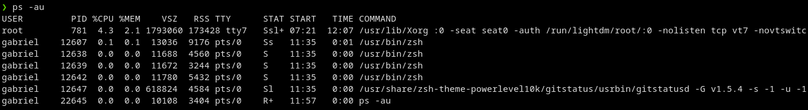
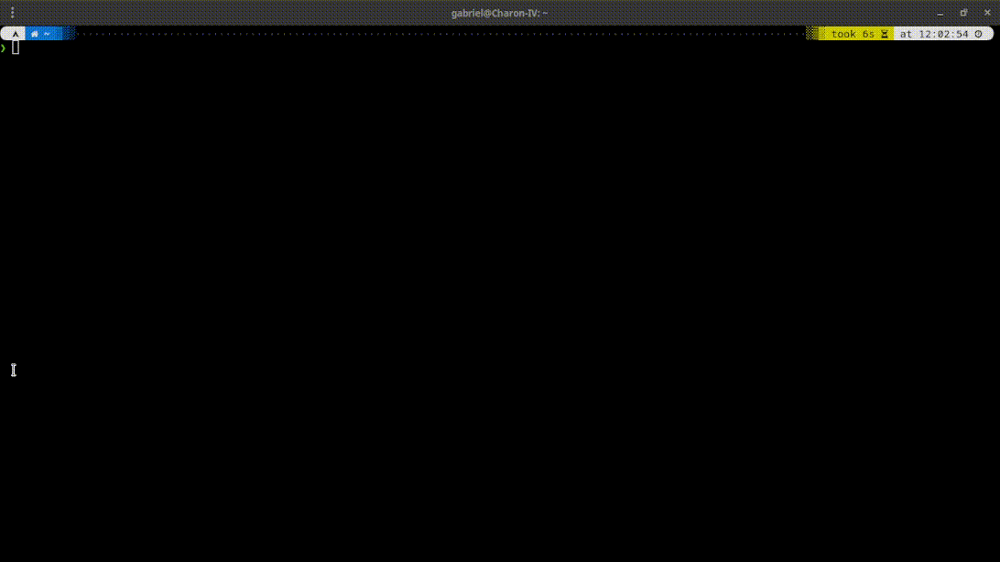
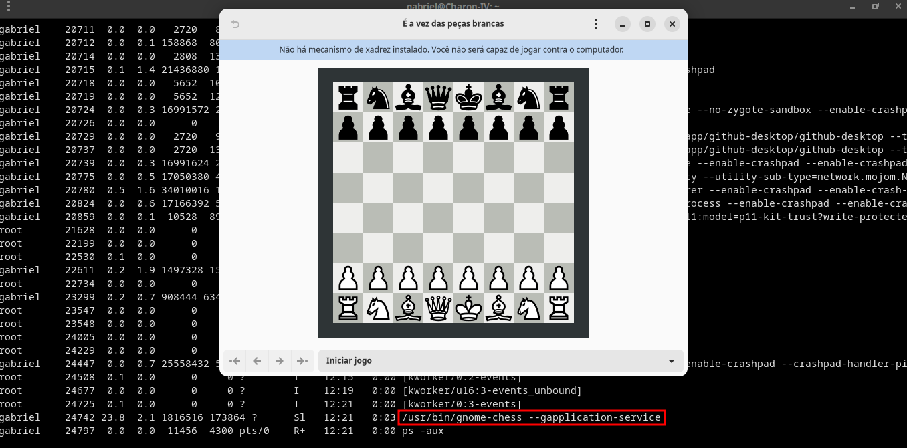
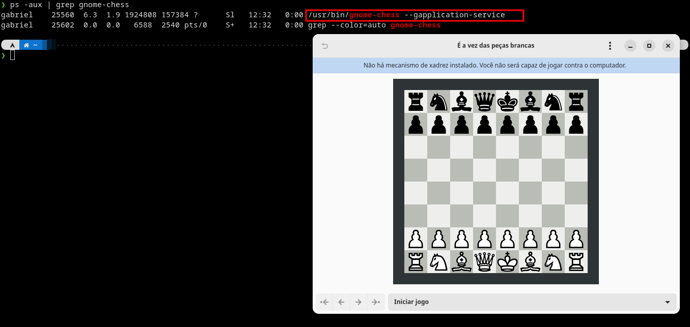
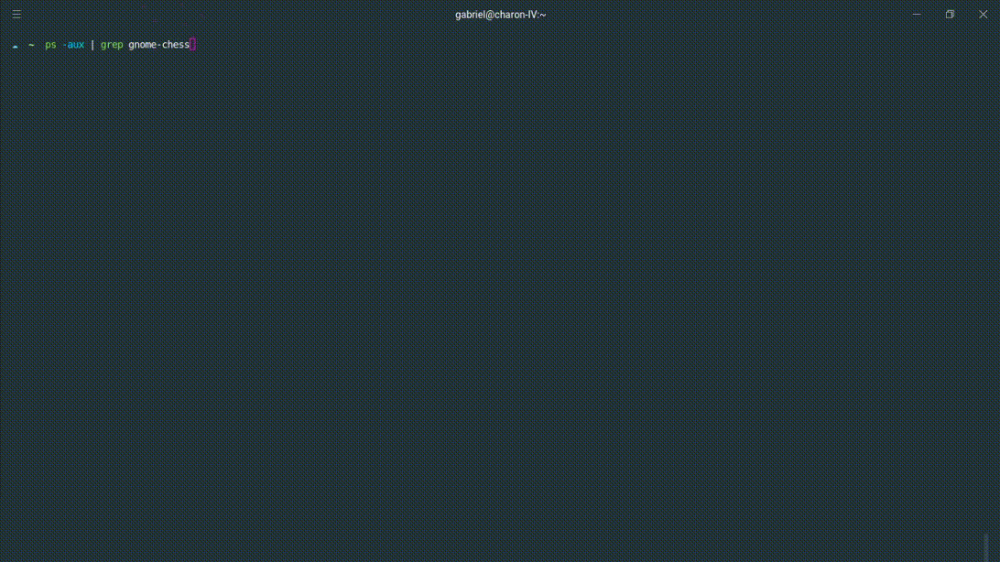
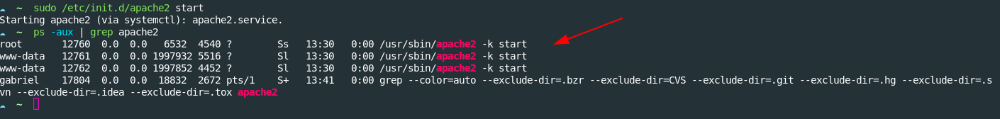
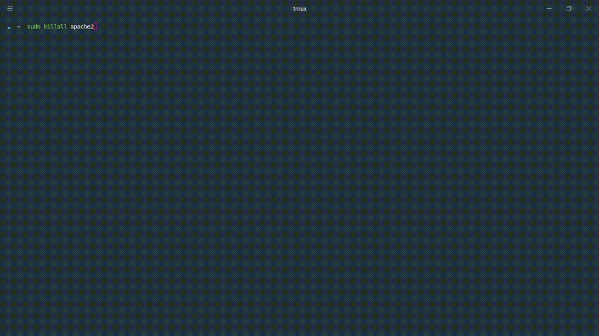

# 🐧 Linux aula 02 pt-01

# Gerenciamento de Processos

*Um programa de computador é algo, adormecido em um disco rígido de um equipamento. Quando chamamos um comando ou clicamos em um lançador de programa em uma interface gráfica, ele se torna um processo. Ou seja, um processo é um programa em execução.*

*No entanto, em alguns momentos, processos podem travar ou consumir recursos demais de uma máquina. Os comandos a seguir permitem a um administrador monitorar os processos em andamento, verificando o consumo de recursos e podendo, até mesmo, destruir processos.*

<hr>
<br>

### **PS** - Listar Processos

*O comando **"ps"** permite listar os processos atuais de um sistema e é, geralmente, acompanhado pelos parâmetros: **"-a"**, que mostra os processos de todos os usuários (permissão de root para tal), **"-u"**, que exibe uma lista detalhada contendo o usuário dono do processo e **"-x"**, que exibe processos que não estejam associados ao terminal de comandos (pois cada processo tem uma origem, ao usar o parâmetro, podemos ver processos da interface gráfica por exemplo, que é considerada outro terminal).*

```sh
  ps -au
```


<br>
<hr>

### **TOP** - Monitor de Processos

*O comando **"top** não é apenas um monitor de processos, ele permite obter informações importantes, como o total de  processos em andamento, seus estados no momento (executando, em espera, parados e zombies), uso de CPU, memória RAM e memória de SWAP.*

```sh
  top
```



*Encabeçando a lista, estão sempre os processos que consomem mais recursos do sistema.*

*Para sair do comando **"top"**(ele trava o terminal), digite **"q"**(quit,sair).*

<hr>
<br>

### **KILL e KILLALL** - Matando Processos

*Eventualmente, um administrador de sistema precisa interromper processos em andamento de maneira abrupta, seja por estarem consumindo recursos indesejados, seja lpor representarem algum risco ao sistema.*

*Para demonstrar seu funcionamento, aproveitei a interface gráfica e abro o aplicativo gnome-chess, que faz parte do pacote padrão para desktop do Ubuntu.*

*Caso não esteja instalado o **gnome-chess**:*

```sh
  sudo apt install gnome-chess 
```

*Trata-se de um bom momento para demonstrar a possibilidade de combinar comandos: a execução do comando **"ps"**, especialmente com os parâmetros **"-aux"**, pode ficar longa e confusa. O simbolo **"|"**(ou pipe) permite combinar um comando a outro. Observe o que acontece quando combino o comando **"ps -aux"** com o comando **"grep"**, que permite busca por palavras-chave:*

```sh
  ps -aux
```


<hr>
<br>
<br>

```sh
  ps -aux | grep gnome-chess
```



*A lista de processos mostra apenas duas linhas: o processo gnome-chess e a própria execução do comando **grep** (que, afinal, possui a palavra-chave).*

<br>

*Para "matar" o processo gnome-chess, usamos o sugestivo comndo **kill**(que em inglês significa "matar"), acompanhado do indentificador do processo (PID), informado na segunda coluna do comando  **ps -aux**.*

<br>

*Matando o processo:*

```sh
  kill PID 
```



*Embora o comando se chame **kill**, ele pode ser utilizado para mandar sinais diferentes ao processo. Por exemplo, o uso do parâmetro **-SIGSTOP** no comando **kill** não destruiria o processo, apenas o pausaria ou congelaria. Sendo assim, um processo com a compressão de um arquivo (comando **tar**) que demorasse muito tempo não precisaria ser necessariamente interrompido, caso precisasse liberar recursos de sistema. O parâmetro **-SIGCONT** descongela o processo, que retoma seu processamento exatamente de onde parou.*

```sh
  kill -SIGSTOP PID
```

<br>

*Há uma variação do comando **kill**, conhecido como **killall**(ou "matar todos"), que deve ser acompanhado pelo nome do processo (e não o PID). Isso acontece pois, como sugere, o comando pode destruir todos os processos que possuam o mesmo nome.*


*Para a demonstração, usei o servidor web mais utilizado do mundo, o Apache Web Service; caso precise de um servidor web, não deixe de instalá-lo com o comando:*

```sh
  sudo apt install apache2
```

*O apache é útil neste exemplo, pois como todo serviço escalonável, ele cria subprocessos conforme a necessidade de atender a muitas requisições de rede. Logo "de cara", seu processso principal gera outros dois processos, assim, temos três processos chamados apache2.*



*O primeiro comando:*

```sh
  sudo /etc/init.d/apache2 start
```
*é a inicialização do daemon do apache2, o gerenciador de serviço; ou seja, é assim que um serviço no Linux é inicializado.*

*Ao executar:*

```sh
  ps -aux | grep apache2
```
*repare que possuo três processosm sendo um principal e dois subprocessos(embora não saiba dizer qual é qual). O comando:*

```sh
  killall apache2
```
*é acompanhado pelo **sudo**, pois o serviço pertence ao usuário **www-data** e como podemos ver, ao listar os processos novamente, o comando faz serviço sem deixar vestígios.*



*Outra forma de interromper processos é fechar o terminal no qual eles rodam. Processos não possuem apenas um usuário dono, mas um terminal (seja ele gráfico ou não) associado a eles.*